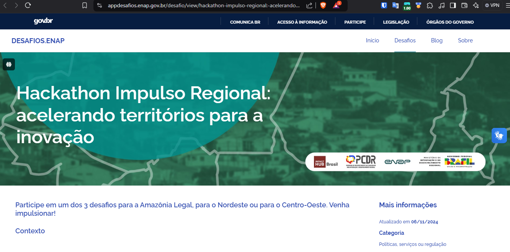

# Hackathon Impulso Regional

 
  <a href="https://appdesafios.enap.gov.br/desafio/view/hackathon-impulso-regional:-acelerando-territorios-para-a-inovacao">link aqui</a>

<b>Desafio 1 - Desenvolvimento de Capacidades Locais - Amazônia Legal:</b> Ganhar escala no desenvolvimento de capacidades de gestores públicos locais para implementação de políticas ou serviços públicos regionalizados na Amazônia Legal. 

Time: 
<ul>
  <li><a href="https://github.com/venelouis">@venelouis<a/></li>
  <li><a href="https://github.com/afonsoartoni">Afonso Artoni</a></li>
  <li><a>em breve mais...</a></li>
</ul>
